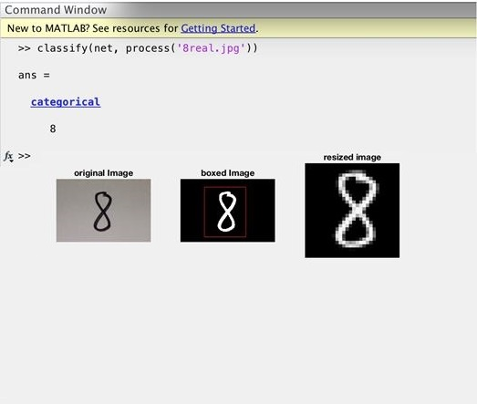

# MNIST-Matlab

A Program to recognize digits in real-time using Convolutional Neural Network written in Matlab.

* **loadMNISTImages.m**, **loadMNISTLabels.m** are functions used to load the images and labels of both the training and test sets (ubyte files)
* Image of each digits are taken using camera and saved as ‘jpg’ file and put in the same folder as the m files. Read the image into console, and using classify() function that was trained on the network to classify the actual hand written digits.
* There is a function named **process.m** associated with the program. It is capable of reading in an image and process it so that the original image has the same format as the MNIST dataset which the model was trained on. The main code is in **Project6.m**.
* First, the original image is converted to gray scale, and then the number is cropped from the redundant background using ‘largest connected component’, box that region surrounding the image and then resize it to 28x28 just like the MNIST dataset.
* From here, the model can classify the digits.

